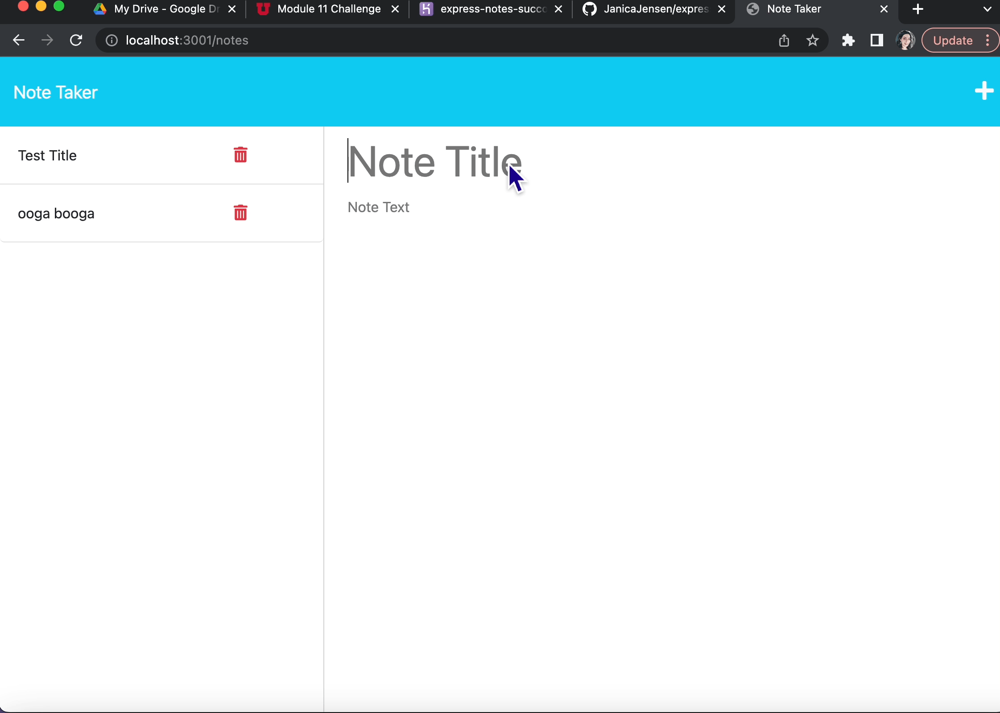

# Express Note Taker
A simple SVG logo maker, done as an assignment for class. 

## Description

This is an app that allows users the simple task of saving notes. The notes are saved with a title attached, and the user can recall and delete the individual notes. This is done without a true database, rather saving the notes in a JSON format on the back end. 

## Table of Contents

1. [Team](#team)
2. [Installation](#installation)
3. [Usage](#usage)
4. [Tests](#tests)
5. [Bugs](#bugs)
6. [Questions](#questions)
7. [Contribution Guidelines](#contribution-guidelines)
8. [License](#license)

## Team

---

The starter code was provided by University of Utah & EdEX bootcamps and I added to it mostly with the help of the internet, though it was much easier to come back and fix it after having done project 2. 

_Other tools utilized:_

Node.js: https://nodejs.org/en

npm express: https://www.npmjs.com/package/express
This is in charge of all the routing. 

npm uuid: https://www.npmjs.com/package/uuid
This was there to be a pseudo-databse package. It allows us to keep track of our notes.

## Installation

---

It should be as simple as navigating to the Heroku deployment URL which is https://express-notes-succotash.herokuapp.com/ . 

## Usage

---

One should be able to navigate to the URL and then click "get started" and be taken to a home page that allows for the user to enter in notes. The user can enter a note title and a note. The note title has a character limit of 28. The user cannot save the note without entering a title and a note itself. They are then saved in json format in a backend file. 

## Tests

---

I did not write any tests for this app.

## Bugs

---

There are no known bugs, actually. For once my thing just works!😀 

## Questions

---

Please refer any questions to: janicajackson@gmail.com

**GitHub profile:** https://github.com/janicajensen

## Contribution Guidelines

---

If anyone wishes to contribute to this project, they may find the GitHub repository at https://github.com/JanicaJensen/express_notes_succotash and they are welcome to create a fork.

## License

---

This project is covered under the MIT license.
More info can be found by clicking the badge above the description.

